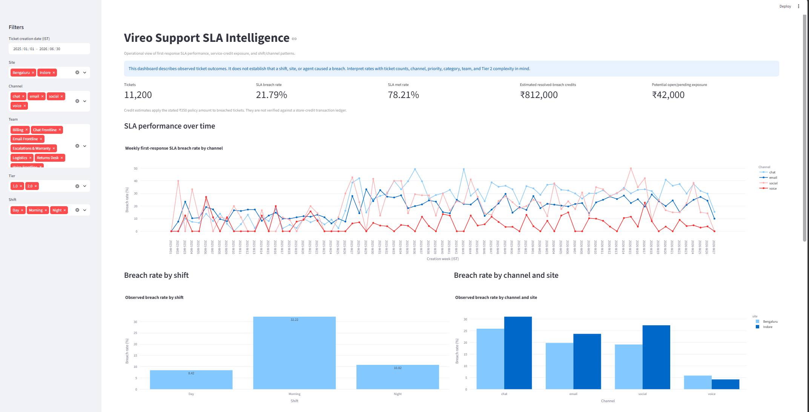
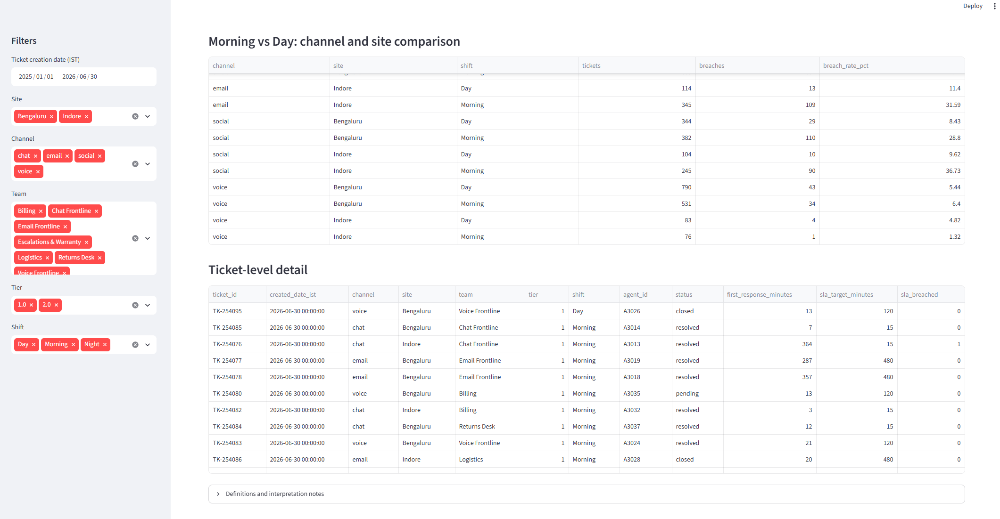

# Vireo Support SLA Intelligence

A support operations analytics project for examining first-response SLA performance, validating ticket and roster data, and estimating policy-based store-credit exposure.

The project includes a Python data-processing pipeline, automated tests, validation checks, and an interactive Streamlit dashboard.

## Business Objective

Analyze support tickets across channels, sites, teams, and shifts to understand first-response SLA outcomes and identify patterns that warrant operational investigation.

The analysis is descriptive. It does not establish that a particular shift, site, team, or agent caused an SLA breach.

## Business Goal

The analyzed dataset contains 11,200 tickets, of which 2,440 breached the first-response SLA, representing a breach rate of 21.79%.

A proposed operational target is to reduce the breach rate to 15%.

At the same ticket volume, this would represent approximately 760 fewer breaches. Using the stated policy amount of ₹350 per breach, the potential avoided credit exposure would be approximately ₹2.66 lakh over the analyzed period.

This is an illustrative improvement target, not a guaranteed saving. Actual financial impact would depend on ticket volume, policy application, and validation against the store-credit transaction ledger.

## Project Capabilities

- Load and inspect support tickets and agent roster data.
- Normalize legacy CSAT values and remove duplicate ticket records.
- Match tickets to date-effective agent roster assignments.
- Calculate first-response SLA status using channel-specific targets.
- Generate ticket-level and weekly SLA analysis.
- Validate ticket identifiers, timestamps, roster matching, and breach reconciliation.
- Display key metrics and breakdowns in an interactive Streamlit dashboard.
- Estimate policy-based store-credit exposure using the stated ₹350-per-breach assumption.
- Provide ticket-level details for further investigation.

## SLA Targets

| Channel | First-response target |
|---|---:|
| Chat | 15 minutes |
| Voice | 120 minutes |
| Social | 240 minutes |
| Email | 480 minutes |

A response is considered within SLA when its response time is less than or equal to the applicable target.

## Dashboard Screenshots

### Dashboard Overview

The dashboard displays key SLA metrics, weekly performance trends, and breach-rate comparisons by shift, channel, and site.



### Channel, Site, and Ticket-Level Details

The dashboard provides channel and site comparisons, a Morning-versus-Day view, and ticket-level records for further investigation.



## Project Structure

```text
Vireo-Support-Intelligence/
├── app.py
├── README.md
├── requirements.txt
├── pyproject.toml
├── uv.lock
├── .python-version
├── .gitignore
│
├── data/
│   ├── agents.csv
│   ├── customers.csv
│   ├── email-thread.txt
│   ├── orders.csv
│   ├── products.csv
│   ├── README.txt
│   ├── support-policy.pdf
│   └── tickets.csv
│
├── outputs/
│   ├── cleaned_tickets.csv
│   ├── ticket_sla_analysis.csv
│   ├── weekly_sla_summary.csv
│   └── validation_report.json
│
├── screenshots/
│   ├── dashboard-overview.png
│   └── ticket-details.png
│
├── src/
│   ├── __init__.py
│   ├── data_cleaning.py
│   ├── data_loader.py
│   ├── prepare_data.py
│   ├── sla_analysis.py
│   └── validation.py
│
├── tests/
│   ├── test_data_quality.py
│   ├── test_roster.py
│   └── test_sla.py
│
└── submission/
    ├── assumptions.md
    ├── business_memo.md
    └── submission-form.md
```

## Requirements

- Python version specified in `.python-version`
- `uv` package manager
- Dependencies listed in `pyproject.toml` and `uv.lock`

## Setup

Clone the repository and navigate to the project directory:

```bash
git clone <your-public-github-repository-url>
cd Vireo-Support-Intelligence
```

Install dependencies:

```bash
uv sync
```

## Run the Data Pipeline

Run the following commands from the project root directory.

### 1. Prepare and clean the data

```bash
python -m src.prepare_data
```

This prepares the cleaned ticket dataset.

### 2. Calculate SLA performance

```bash
python -m src.sla_analysis
```

This generates ticket-level SLA results and weekly summaries.

### 3. Run data validation

```bash
python -m src.validation
```

This checks key data-quality and reconciliation conditions.

## Launch the Dashboard

```bash
streamlit run app.py
```

Open the local URL shown in the terminal, typically:

```text
http://localhost:8501
```

The dashboard includes:

- Ticket volume and SLA performance KPIs
- Estimated resolved-breach credit exposure
- Potential open/pending exposure
- SLA performance over time
- Breach-rate comparisons by shift
- Channel and site comparisons
- Morning-versus-Day comparison
- Ticket-level details
- Interactive filters

## Run Automated Tests

```bash
python -m pytest -q -p no:cacheprovider
```

The test suite covers data quality, duplicate handling, effective-date roster matching, and SLA calculation behavior.

## Verified Results

The latest verified run produced the following results:

| Metric | Result |
|---|---:|
| Cleaned tickets analyzed | 11,200 |
| SLA breaches | 2,440 |
| SLA breach rate | 21.79% |
| SLA met rate | 78.21% |
| Estimated resolved-breach credits | ₹812,000 |
| Potential open/pending exposure | ₹42,000 |
| Automated tests passed | 11 |
| Data validation checks passed | 9 |

The credit estimates apply the stated ₹350 policy amount to the relevant breached tickets. They are estimates and have not been reconciled against a store-credit transaction ledger.

## Validation and Limitations

The project includes automated tests and data validation checks for key processing rules, including ticket identifiers, timestamps, roster matching, SLA flags, and reconciliation.

The analysis has the following limitations:

- Results depend on the completeness and accuracy of the supplied data.
- The analysis is descriptive and does not establish causation.
- Differences between shifts, sites, teams, or agents may reflect ticket volume, channel mix, priority, category, or case complexity.
- Estimated credit exposure is not verified against a financial transaction ledger.
- The dashboard is a local analytical prototype and has not been presented as a production deployment.

Interpret breach rates alongside ticket counts and relevant operational context before making staffing or performance decisions.

## Submission Documents

The `submission/` directory contains:

- `assumptions.md` — data assumptions and interpretation decisions.
- `business_memo.md` — business findings and recommendations for Neha Kulkarni.
- `submission-form.md` — assignment submission responses.

## Technology Stack

- Python
- Pandas
- Streamlit
- Plotly
- Pytest
- uv